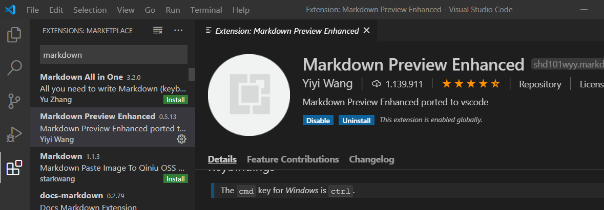
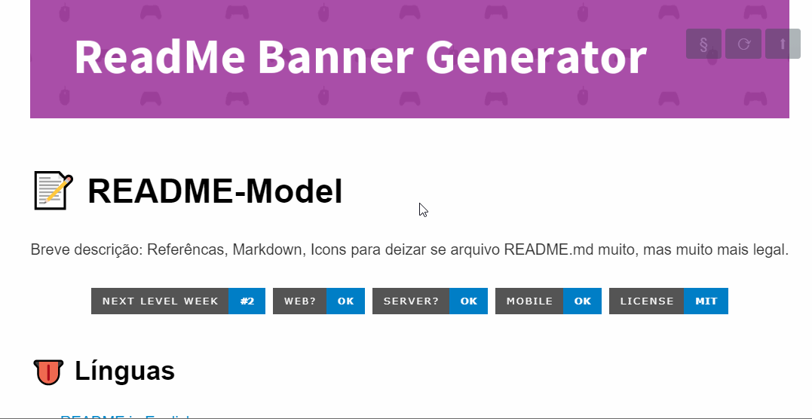

<h1 align="center">
    <a href="https://laravelcollective.com/tools/banner">
        
    </a>
</h1>

# 📝 README-Model

<p align="center"> Eine kurze Beschreibung: Referenzen, Markdown, Symbole, um die Datei README.md viel, viel cooler zu machen. </p>

<h2 align="center">
  
  
  
  
</h2>

## 👅 Sprachen

- [README auf Englisch](README-EN.md)
- [README auf Japanisch](README-JA.md)
- [README in Portugiesisch (Brasilien)](README.md)

## 😍 Ikon

- [Ikon](gistfile1.md)

 ## 📌 Index      
 
 <p align = "center">          
    <a href="#logo-oder-banner"> Logo oder Banner </a> &nbsp; &nbsp; &nbsp; | &nbsp; &nbsp; &nbsp;        
    <a href="#projektname"> Projektname </a> &nbsp; &nbsp; &nbsp; | &nbsp; &nbsp; &nbsp;          
    <a href="#beschreibung"> Beschreibung</a> &nbsp; &nbsp; &nbsp; | &nbsp; &nbsp; &nbsp;    
    <a href="#index"> Index</a> &nbsp; &nbsp; &nbsp; | &nbsp; &nbsp; &nbsp;    
    <a href="#uber-die-readme"> Über die README </a> &nbsp;&nbsp;&nbsp;|&nbsp;&nbsp;&nbsp;     
    <a href="#badges"> Badges </a> &nbsp; &nbsp; &nbsp; | &nbsp; &nbsp; &nbsp;        
    <a href="#visuals-und-screenshots"> Visuals und Screenshots </a> &nbsp; &nbsp; &nbsp; | &nbsp; &nbsp; &nbsp;        
    <a href="#techniker"> Techniker </a> &nbsp; &nbsp; &nbsp; | &nbsp; &nbsp; &nbsp;        
    <a href="#installation"> Installation </a> &nbsp; &nbsp; &nbsp; | &nbsp; &nbsp; &nbsp;        
    <a href="#verwendung"> Verwendung </a> &nbsp; &nbsp; &nbsp; | &nbsp; &nbsp; &nbsp;        
    <a href="#projektstatus"> Projektstatus </a> &nbsp; &nbsp; &nbsp; | &nbsp; &nbsp; &nbsp;        
    <a href="#beiträge"> Beiträge </a> &nbsp; &nbsp; &nbsp; | &nbsp; &nbsp; &nbsp;        
    <a href="#autoren-und-bestätigung"> Autoren und Bestätigung </a> &nbsp; &nbsp; &nbsp; | &nbsp; &nbsp; &nbsp;          
    <a href="#referenzen"> Referenzen </a> &nbsp; &nbsp; &nbsp; | &nbsp; &nbsp; &nbsp;        
    <a href="#lizenz"> Lizenz </a>      
 </p>            
 
 ## ❔ Über die README           
 
 Jedes Projekt ist anders. Überlegen Sie also, welcher dieser Abschnitte für Sie gilt.  Die in der Vorlage verwendeten Abschnitte sind Vorschläge für die meisten Open Source-Projekte.  Denken Sie auch daran, dass eine README-Datei zwar zu lang und detailliert sein kann, zu lang jedoch besser als zu kurz ist. 
 
 Wenn Sie der Meinung sind, dass Ihre README-Datei zu lang ist, sollten Sie eine andere Form der Dokumentation verwenden, anstatt Informationen auszuschneiden.           
 
### ⌨️ Was ist Markdown?

Markdown ist ein Tool zur Konvertierung von Text in HTML. Sie schreiben mit einfachem, leicht lesbarem und leicht zu schreibendem Text und wandeln ihn dann in gültigen HTML-Code um.

Markdown wurde von John Gruber und Aaron Swartz erstellt und ihr Quellcode wurde in Perl geschrieben. Dies ist die offizielle Website [hier] (https://daringfireball.net/projects/markdown/)

Sie können MarkDown-Indizes in VS Code anzeigen und erstellen, indem Sie eine Erweiterung hinzufügen:
<h1 align="center">
    
</h1>

| Verknüpfungen | Funktionalität |
|: ---------- | ------ |
| cmd-k v oder ctrl-k | Öffnen Sie die Vorschau zur Seite |
| cmd-shift-v oder ctrl-shift-v | Vorschau öffnen |

Darüber hinaus wird die Erstellung von Tabellen durch Websites wie:

[Tables Generator](https://www.tablesgenerator.com/markdown_tables)

        
## Logo oder Banner

Status: Optional

Wenn Ihr Projekt bereits ein Logo hat, fügen Sie es der README-Datei hinzu. Es kann auch ein Banner sein. Sie können mit Canva ein Logo oder Banner erstellen.

Das Logo oder Banner ersetzt möglicherweise den Titel, nicht jedoch die Beschreibung des Projekts. Das Gute daran, den Titel und die Beschreibung im Text zu behalten, ist, dass es bei Github SEO hilft. Google hilft dabei, Ihr Projekt auf den ersten Seiten der Suche besser zu indizieren und gibt eine Zusammenfassung über Ihr Projekt.

## Projektname           
 
 Wählen Sie einen selbsterklärenden Namen für Ihr Projekt.           
 
 ## Beschreibung           
 
 Lassen Sie die Leute wissen, was Ihr Projekt konkret tun kann.  Geben Sie den Kontext an und fügen Sie einen Link zu Referenzbesuchern hinzu, mit denen Sie möglicherweise nicht vertraut sind.  Hier kann auch eine Liste der Funktionen oder ein Unterabschnitt Hintergrund hinzugefügt werden.  Wenn es Alternativen zu Ihrem Projekt gibt, ist dies ein guter Ort, um differenzierende Faktoren aufzulisten.           
 
 ### 🧐 Motivation           
 
 Motivationsbeschreibung    
------------------------

 ## ❔ Über die README           
 
 Jedes Projekt ist anders. Überlegen Sie also, welcher dieser Abschnitte für Sie gilt.  Die in der Vorlage verwendeten Abschnitte sind Vorschläge für die meisten Open Source-Projekte.  Denken Sie auch daran, dass eine README-Datei zwar zu lang und detailliert sein kann, zu lang jedoch besser als zu kurz ist. 
 
 Wenn Sie der Meinung sind, dass Ihre README-Datei zu lang ist, sollten Sie eine andere Form der Dokumentation verwenden, anstatt Informationen auszuschneiden.           

### ⌨️ Was ist Markdown?

Markdown ist ein Tool zur Konvertierung von Text in HTML. Sie schreiben mit einfachem, leicht lesbarem und leicht zu schreibendem Text und wandeln ihn dann in gültigen HTML-Code um.

Markdown wurde von John Gruber und Aaron Swartz erstellt und ihr Quellcode wurde in Perl geschrieben. Dies ist die offizielle Website [hier] (https://daringfireball.net/projects/markdown/)

Sie können MarkDown in VS Code anzeigen, indem Sie eine Erweiterung hinzufügen:

Sie können MarkDown in VS Code anzeigen, indem Sie eine Erweiterung hinzufügen:

<h1 align="center">
    
</h1>

| Verknüpfungen | Funktionalität |
|:----------|------|
|cmd-k v or ctrl-k| Open preview to the Side| 
|cmd-shift-v or ctrl-shift-v  |  Open preview |

 ## Badges           
 
 In einigen READMEs werden möglicherweise kleine Bilder angezeigt, die Metadaten enthalten, z. B. ob alle Tests für das Projekt bestanden wurden oder nicht.  Sie können Shields verwenden, um einige zu Ihrer README hinzuzufügen.  Viele Dienste haben auch Anweisungen zum Hinzufügen eines Ausweises.           
 
 ## 📸 Visuals und Screenshots           
 
 Je nachdem, was Sie machen, kann es eine gute Idee sein, Screenshots oder sogar ein Video einzuschließen (häufig werden GIFs anstelle von tatsächlichen Videos angezeigt).  Tools wie ttygif können helfen, aber schauen Sie sich Asciinema für eine ausgefeiltere Methode an.    

 -------------           
### GIF Image
<p align="center">
  
</p>
    
 
 ## Technologien              
 
 | Tag | Beschreibung | Technologien |
|:---:|---------|:-----------:|
|  03/08  |Beschleunigung Ihrer Evolution|    |
|  **05/08**  |**Die Wahl des Stapels**|              |
|  **07/08**  |**Die Extrameile**|   
     
 
 ### Funktionen           
 
 #### Vorlesung 1: Thema
- [x] Erstellen einer Zielseitenstruktur 
- [ ] Landing Page stilisieren 
- [ ] Authentifizierung
  - [x] Anmelden / Abmelden 
  - [x]  Angemeldet bleiben - Token        
 
 ## ⚙ Installation           
 
 Innerhalb eines bestimmten Ökosystems gibt es möglicherweise eine übliche Methode zur Installation von Dingen, z. B. die Verwendung von Garn, NuGet oder Homebrew.  Berücksichtigen Sie jedoch die Möglichkeit, dass jeder, der Ihre README-Datei liest, ein Anfänger ist und weitere Anleitungen wünscht.  Das Auflisten bestimmter Schritte hilft dabei, Unklarheiten zu beseitigen, und bringt die Benutzer dazu, Ihr Projekt so schnell wie möglich zu verwenden.  Wenn es nur in einem bestimmten Kontext wie einer bestimmten Programmiersprachenversion oder einem bestimmten Betriebssystem ausgeführt wird oder Abhängigkeiten aufweist, die manuell installiert werden müssen, fügen Sie auch einen Unterabschnitt Anforderungen hinzu.    

 -------------           
 
 ### Befehle zur Installation auf dem MAC           
 
| Technologie | Version | Befehl zum Installieren |
|:----------|------|---------------------|
|NodeJS| 12.18.2| ``` brew install node ``` |
|Yarn  |  1.17.3 | ```npm install -g yarn``` |
|Expo  |  3.23.1 |  ```yarn add global expo-cli```|         
 
 ## Verwendung           
 
 Verwenden Sie Beispiele großzügig und zeigen Sie die erwartete Ausgabe, wenn Sie können.  Es ist hilfreich, das kleinste Anwendungsbeispiel, das Sie demonstrieren können, inline zu haben und Links zu komplexeren Beispielen bereitzustellen, wenn diese zu lang sind, um in die README-Datei aufgenommen zu werden.  

   -------------           
 
 ### Zeichen      
 ----           
~~Strikethrough~~ <s>Strikethrough (when enable html tag decode.)</s>
*Italic*      _Italic_
**Emphasis**  __Emphasis__
***Emphasis Italic*** ___Emphasis Italic___

Superscript: X<sub>2</sub>，Subscript: O<sup>2</sup>

### Code Blocks (Indented style)

### Inline code

`$ npm install marked`

Indented 4 spaces, like `<pre>` (Preformatted Text).

    <?php
        echo "Hello world!";
    ?>
    
Code Blocks (Preformatted text):

    | First Header  | Second Header |
    | ------------- | ------------- |
    | Content Cell  | Content Cell  |
    | Content Cell  | Content Cell  |

### HTML code

```html
<!DOCTYPE html>
<html>
    <head>
        <mate charest="utf-8" />
        <title>Hello world!</title>
    </head>
    <body>
        <h1>Hello world!</h1>
    </body>
</html>
```
### HTML entities

&copy; &  &uml; &trade; &iexcl; &pound;
&amp; &lt; &gt; &yen; &euro; &reg; &plusmn; &para; &sect; &brvbar; &macr; &laquo; &middot; 

X&sup2; Y&sup3; &frac34; &frac14;  &times;  &divide;   &raquo;

18&ordm;C  &quot;  &apos;

### Escaping for Special Characters

\*literal asterisks\*    
 
 ### Klonen           

 Klonen Sie zunächst das Repository für Ihre Umgebung: 

```bash
> git clone https://github.com/shyoutarou/REPO_NAME.git 
```
Geben Sie dann das geklonte Repository und das Verzeichnis ein, das dem zu testenden Repository (Web, Server) entspricht.  Geben Sie kurz darauf für jedes Verzeichnis die folgenden Befehle in Ihr Terminal ein:           
 
 ### 📦 Führen Sie die REST-Server-API aus           
 
 ```bash
# Entra no diretório "REPO_NAME"
> cd ./REPO_NAME

# Instala todas as dependências
> yarn install or npm install
 ```

 ## Projekt-Status           
 
 Wenn Ihnen die Energie oder Zeit für Ihr Projekt ausgeht, schreiben Sie oben in die README-Datei, dass sich die Entwicklung verlangsamt oder vollständig gestoppt hat.  Jemand kann sich dafür entscheiden, Ihr Projekt zu teilen oder sich freiwillig als Betreuer oder Eigentümer zu melden, damit Ihr Projekt weiterlaufen kann.  Sie können auch eine explizite Anfrage für Betreuer stellen.           
 
 ## 🐛 Probleme           
 
 Bieten Sie Menschen eine Kontaktform.  Dies kann eine beliebige Kombination von Kontakten, einem Chatroom, einer E-Mail-Adresse usw. sein.      

 -------------      
 > Sie können ein neues Problem mit Titel und Beschreibung im Proffy-Repository registrieren.      
 > Wenn Sie bereits eine Lösung für Ihr Problem gefunden haben, würde ich gerne Ihre Pull-Anfrage überprüfen!           
 
 ## 🤝 Beiträge           
 
 Wenn Sie Ideen für zukünftige Releases haben, ist es eine gute Idee, diese in der README-Liste aufzulisten. Geben Sie an, ob Sie für Beiträge offen sind und welche Anforderungen Sie an die Annahme dieser Beiträge stellen.           
 
 Für Personen, die Änderungen an Ihrem Projekt vornehmen möchten, ist es hilfreich, eine Dokumentation zu den ersten Schritten zu haben.  Vielleicht gibt es ein Skript, das sie ausführen sollten, oder einige Umgebungsvariablen, die sie festlegen müssen.  Machen Sie diese Schritte explizit.  Diese Anweisungen könnten auch für Ihr zukünftiges Selbst nützlich sein.           
 
 Sie können auch Befehle dokumentieren, um den Code zu fusseln oder Tests auszuführen.  Diese Schritte tragen dazu bei, eine hohe Codequalität sicherzustellen und die Wahrscheinlichkeit zu verringern, dass die Änderungen versehentlich etwas beschädigen.  Anweisungen zum Ausführen von Tests sind besonders hilfreich, wenn ein externes Setup erforderlich ist, z. B. das Starten eines Selenium-Servers zum Testen in einem Browser.    

  -------------                      
 
Befolgen Sie die folgenden Schritte, um einen Beitrag zu leisten: 

1. *Fork* das Projekt (<https://github.com/shyoutarou/REPO_NAME.git>)

2. Klonen Sie Ihre *Fork* auf Ihren Computer (`git clone https://github.com/user_name/REPO_NAME.git`)

3. Erstellen Sie einen *branch*, um Ihre Änderung durchzuführen (`git checkout -b feature/name_new_feature`)

4. Fügen Sie Ihre Änderungen hinzu und *commit* (`git commit -m "Descreva sua modificação"`)

5. *Push* (`git push origin feature/name_new_feature`)

6. Erstellen Sie eine neue *Pull Request*

7. Okay, jetzt warte einfach auf die Analyse
 
  ## Autoren und Anerkennung           
  Zeigen Sie denen, die zum Projekt beigetragen haben, Ihre Wertschätzung.    

-------------
 <div align=center>
  <table style="width:100%">
    <tr align=center>
      <th><strong>Eu</strong></th>
    </tr>
    <tr align=center>
      <td>
        <a href="https://github.com/shyoutarou">
          
        </a>
      </td>
    </tr>
  </table>
</div>    
 
 ## ***Verweise***

* Banner
    - [Laravel Collective](https://laravelcollective.com/tools/banner)

* MarkDown
    - [Editor.md](https://pandao.github.io/editor.md/en.html)
    - [Dillinger](https://dillinger.io/)
    - [Stackedit](https://stackedit.io/) 
    - [Devbaraus](https://github.com/devbaraus/markdown-showcase) 
    - 
* Badges
    - [Shields](https://shields.io/)
    - [How to Make Custom Badges](https://dev.to/milkers/how-to-make-custom-badges-to-improve-your-markdown-documents-460k)
    - [Badger](http://badges.github.io/badgerbadgerbadger/)

* GIFS
    - [Recordit](https://recordit.co/)
    - [ttystudio](https://github.com/chjj/ttystudio)    

* Guias
    - [Como fazer um bom README](https://blog.rocketseat.com.br/como-fazer-um-bom-readme/)
    - [Make a README](https://www.makeareadme.com/)             
    - [sampleREADME.md](https://gist.github.com/fvcproductions/1bfc2d4aecb01a834b46)

 ## 📜 Lizenz           
 
 Wenn Ihr Projekt Open Source ist, ist es wichtig, eine Lizenz beizufügen.   

 -------------      
 Das 2020 veröffentlichte Projekt unter der Lizenz [MIT] (./ LIZENZ) ❤️      
 Hergestellt mit ❤️ von Shyoutarou      
 Gefallen?  Hinterlasse einen kleinen Stern, um das Projekt zu unterstützen ⭐           
 
 - [Zurück nach oben](#index)
