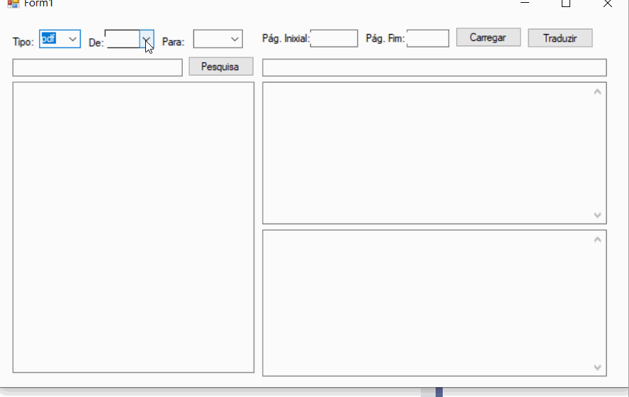

# README-Model

Referêncas, Markdown, Icons para deizar se arquivo README,md legal.


<h1 align="center">
    
</h1>

<h2 align="center">
  
  
  
  
  
</h2>

## 👅 Línguas

- [README in English](README-EN.md)
- [README in German/Deustch](README-DE.md)
- [README in Japanese](README-JA.md)


## 😍 Ícones

- [Ícones](gistfile1.md)

## 📌 Index
<p align="center">
  <a href="#-Sobre-README"> Sobre README </a> &nbsp; &nbsp; &nbsp; | &nbsp; &nbsp; &nbsp;        
  <a href="#-Logotipo-ou-Banner"> Logotipo ou Banner </a> &nbsp; &nbsp; &nbsp; | &nbsp; &nbsp; &nbsp;        
  <a href="#-Nome-do-Projeto"> Nome do Projeto </a> &nbsp; &nbsp; &nbsp; | &nbsp; &nbsp; &nbsp;          
  <a href="#-Descrição-e-motivação"> Descrição e motivação </a> &nbsp; &nbsp; &nbsp; | &nbsp; &nbsp; &nbsp;        
  <a href="#-Emblemas"> Emblemas </a> &nbsp; &nbsp; &nbsp; | &nbsp; &nbsp; &nbsp;        
  <a href="#-Visuais-e-Telas"> Visuais e Telas </a> &nbsp; &nbsp; &nbsp; | &nbsp; &nbsp; &nbsp;        
  <a href="#-Tecnologias-utilizadas">Tecnologias </a> &nbsp; &nbsp; &nbsp; | &nbsp; &nbsp; &nbsp;        
  <a href="#-Instalação"> Instalação </a> &nbsp; &nbsp; &nbsp; | &nbsp; &nbsp; &nbsp;        
  <a href="#-Uso"> Uso </a> &nbsp; &nbsp; &nbsp; | &nbsp; &nbsp; &nbsp;        
  <a href="#-Status-do-projeto"> Status do projeto </a> &nbsp; &nbsp; &nbsp; | &nbsp; &nbsp; &nbsp; &nbsp;        
  <a href="#-Issues"> Issues </a>  &nbsp; &nbsp; &nbsp; | &nbsp; &nbsp; &nbsp;  
  <a href="#-contribuições"> Contribuições </a> &nbsp; &nbsp; &nbsp; | &nbsp; &nbsp; &nbsp;        
  <a href="#-Autor-e-Agradecimentos"> Autores e Agradecimentos </a>   
  <a href="#-Referências"> Referências </a>  &nbsp; &nbsp; &nbsp; | &nbsp; &nbsp; &nbsp;  
  <a href="#-Licença"> Licença </a>    
</p>

## 📌 Index em Arquivos
* [Sobre o projeto](#sobre-o-projeto)
* [Motivo](#motivo)
    *  [Utilitários](#utilitários)
    *  [Funcionalidades](#funcionalidades)
- [Screenshots](#screenshots)
         

## ❔ Sobre o README           

Cada projeto é diferente, portanto, considere quais dessas seções se aplicam ao seu.  As seções usadas no modelo são sugestões para a maioria dos projetos de código aberto.  Também tenha em mente que, embora um README possa ser muito longo e detalhado, muito longo é melhor do que muito curto.  Se você acha que seu README é muito longo, considere utilizar outra forma de documentação em vez de cortar as informações. Essa é uma sugestão de estrutura, cada um pode fazer conforme a necessidade do projeto. Vamos agora cobrir cada um dos tópicos da estrutura e outros pontos adicionais.  

## Nome do projeto           

Escolha um nome autoexplicativo para o seu projeto.           

## Descrição          

Deixe as pessoas saberem o que seu projeto pode fazer especificamente.  Forneça contexto e adicione um link para qualquer referência que os visitantes possam não estar familiarizados.  Uma lista de recursos ou uma subseção de plano de fundo também pode ser adicionada aqui.  Se houver alternativas ao seu projeto, este é um bom lugar para listar os fatores diferenciadores.  

### 🧐 Motivo

Descrição do Motivo

## Emblemas           

Em alguns READMEs, você pode ver pequenas imagens que transmitem metadados, como se todos os testes estão passando ou não para o projeto.  Você pode usar Shields para adicionar alguns ao seu README.  Muitos serviços também possuem instruções para adicionar um crachá.           

## 📸 Visuais e Telas 
Dependendo do que você está fazendo, pode ser uma boa ideia incluir capturas de tela ou até mesmo um vídeo (você verá frequentemente GIFs em vez de vídeos reais).  Ferramentas como ttygif podem ajudar, mas dê uma olhada no Asciinema para um método mais sofisticado.    
-------------
### Imagem GIF
<p align="center">
  
</p>

### Imagem PNG
<p align="center">
  
</p>

## Tecnologias                                

| Dia | Descriçao | tecnologias |
|:---:|---------|:-----------:|
|  03/08  |Acelerando sua evolução|    |
|  **05/08**  |**A escolha da stack**|              |
|  **07/08**  |**A milha extra**|             |

### Funcionalidades

#### Aula 1: Tema
- [x] Criando estrutura da landing page
- [ ] Estilizando landing page
- [ ] Autenticação
  - [x] Login / Logout 
  - [x] Permanecer logado - Token

[Detalhes](Aula03.md)

## ⚙ Instalação           
Dentro de um determinado ecossistema, pode haver uma maneira comum de instalar coisas, como usar Yarn, NuGet ou Homebrew.  No entanto, considere a possibilidade de que quem está lendo seu README seja um novato e gostaria de mais orientação.  Listar etapas específicas ajuda a remover ambigüidades e faz com que as pessoas usem seu projeto o mais rápido possível.  Se ele for executado apenas em um contexto específico, como uma determinada versão de linguagem de programação ou sistema operacional ou tiver dependências que devem ser instaladas manualmente, adicione também uma subseção Requisitos.    
-------------
### Comandos para instalar no MAC

| Tecnologia | Versão | Comando para instalar |
|:----------|------|---------------------|
|NodeJS| 12.18.2| ``` brew install node ``` |
|Yarn  |  1.17.3 | ```npm install -g yarn``` |
|Expo  |  3.23.1 |  ```yarn add global expo-cli```|

## Uso           

Use exemplos liberalmente e mostre a saída esperada, se puder.  É útil ter embutido o menor exemplo de uso que você pode demonstrar, enquanto fornece links para exemplos mais sofisticados se eles forem muito longos para serem incluídos no README.      
-------------

### Characters             
----

~~Strikethrough~~ <s>Strikethrough (when enable html tag decode.)</s>
*Italic*      _Italic_
**Emphasis**  __Emphasis__
***Emphasis Italic*** ___Emphasis Italic___

Superscript: X<sub>2</sub>，Subscript: O<sup>2</sup>

### Code Blocks (Indented style)

### Inline code

`$ npm install marked`

Indented 4 spaces, like `<pre>` (Preformatted Text).

    <?php
        echo "Hello world!";
    ?>
    
Code Blocks (Preformatted text):

    | First Header  | Second Header |
    | ------------- | ------------- |
    | Content Cell  | Content Cell  |
    | Content Cell  | Content Cell  |

### HTML code

```html
<!DOCTYPE html>
<html>
    <head>
        <mate charest="utf-8" />
        <title>Hello world!</title>
    </head>
    <body>
        <h1>Hello world!</h1>
    </body>
</html>
```
### HTML entities

&copy; &  &uml; &trade; &iexcl; &pound;
&amp; &lt; &gt; &yen; &euro; &reg; &plusmn; &para; &sect; &brvbar; &macr; &laquo; &middot; 

X&sup2; Y&sup3; &frac34; &frac14;  &times;  &divide;   &raquo;

18&ordm;C  &quot;  &apos;

### Escaping for Special Characters

\*literal asterisks\*

### Clonagem

Primeiro, clone o repositório para seu ambiente:

```bash
> git clone https://github.com/shyoutarou/REPO_NAME.git 
```

Depois, entre no repositório clonado e no diretório correspondente ao que quer testar (web, server).
Logo após, insira os seguintes comandos no seu terminal para cada diretório respectivamente:

### 📦 Executar Server API REST

```bash
# Entra no diretório "REPO_NAME"
> cd ./REPO_NAME

# Instala todas as dependências
> yarn install or npm install

```
## Status do projeto           
Se você ficou sem energia ou tempo para o seu projeto, coloque uma nota no topo do README dizendo que o desenvolvimento foi desacelerado ou parou completamente.  Alguém pode escolher fazer um fork do seu projeto ou se voluntariar para entrar como mantenedor ou proprietário, permitindo que o projeto continue.  Você também pode fazer uma solicitação explícita para mantenedores.           

## 🐛 Issues
Ofereça às pessoas uma forma de contato.  Pode ser qualquer combinação de contatos, uma sala de chat, um endereço de e-mail, etc.   
-------------
> Sinta-se à vontade para registrar um novo problema com o respectivo título e descrição no repositório Proffy. > Se você já encontrou uma solução para seu problema, adoraria revisar sua solicitação de pull!

## 🤝 Contribuições           
Se você tiver ideias para lançamentos no futuro, é uma boa ideia listá-los no README.      Contribuindo           Indique se você está aberto a contribuições e quais são seus requisitos para aceitá-las.           Para as pessoas que desejam fazer alterações em seu projeto, é útil ter alguma documentação sobre como começar.  Talvez haja um script que eles devam executar ou algumas variáveis de ambiente que eles precisem definir.  Torne essas etapas explícitas.  Essas instruções também podem ser úteis para o seu futuro eu.           Você também pode documentar comandos para lintar o código ou executar testes.  Essas etapas ajudam a garantir a alta qualidade do código e a reduzir a probabilidade de que as alterações quebrem algo inadvertidamente.  Ter instruções para a execução de testes é especialmente útil se requer configuração externa, como iniciar um servidor Selenium para testar em um navegador.           
-------------
Siga os passos abaixo para contribuir:

1. Faça o *fork* do projeto (<https://github.com/shyoutarou/REPO_NAME.git>)

2. Clone o seu *fork* para sua maquína (`git clone https://github.com/user_name/REPO_NAME.git`)

3. Crie uma *branch* para realizar sua modificação (`git checkout -b feature/name_new_feature`)

4. Adicione suas modificações e faça o *commit* (`git commit -m "Descreva sua modificação"`)

5. *Push* (`git push origin feature/name_new_feature`)

6. Crie um novo *Pull Request*

7. Pronto, agora só aguardar a análise 

## Autores e reconhecimento          
Mostre sua gratidão àqueles que contribuíram para o projeto.          
-------------
 <div align=center>
  <table style="width:100%">
    <tr align=center>
      <th><strong>Eu</strong></th>
    </tr>
    <tr align=center>
      <td>
        <a href="https://github.com/shyoutarou">
          
        </a>
      </td>
    </tr>
  </table>
</div> 
 
## ***Referências***

* MarkDown
    - [Editor.md](https://pandao.github.io/editor.md/en.html)
    - [Dillinger](https://dillinger.io/)
    - [Stackedit](https://stackedit.io/) 

* Badges
    - [Shields](https://shields.io/)
    - [How to Make Custom Badges](https://dev.to/milkers/how-to-make-custom-badges-to-improve-your-markdown-documents-460k)

* Guias
    - [Como fazer um bom README](https://blog.rocketseat.com.br/como-fazer-um-bom-readme/)
    - [Make a README](https://www.makeareadme.com/)

## 📜 Licença           
Para projetos de código aberto, diga como está licenciado.
-------------
O projeto publicado em 2020 sobre a licença [MIT](./LICENSE) ❤️ 

Made with ❤️ by Shyoutarou

Gostou? Deixe uma estrelinha para ajudar o projeto ⭐

- [Voltar ao Início](#Index)


